# Physical AI & Humanoid Robotics Textbook Spatial Structure

## Site Map

```mermaid
graph TD
    A[Physical AI & Humanoid Robotics Textbook] --> B[Preface/Week 0]
    A --> C[Module 1: ROS 2 Basics to URDF Humanoid Setup]
    A --> D[Module 2: Gazebo & Unity]
    A --> E[Module 3: NVIDIA Isaac]
    A --> F[Module 4: VLA Integrations and Capstone]
    A --> G[Appendices]

    C --> C1[Week 1: Introduction to ROS 2]
    C --> C2[Week 2: ROS 2 Nodes and Topics]
    C --> C3[Week 3: ROS 2 Services and Actions]
    C --> C4[Week 4-5: URDF Humanoid Setup]

    D --> D1[Week 6: Gazebo Simulation Environment]
    D --> D2[Week 7: Unity Integration]

    E --> E1[Week 8: NVIDIA Isaac Overview]
    E --> E2[Week 9: Isaac Simulation]
    E --> E3[Week 10: Isaac Deployment]

    F --> F1[Week 11: Vision-Language-Action Models]
    F --> F2[Week 12: AI-Robot Integration]
    F --> F3[Week 13: Capstone Project]

    G --> G1[Hardware Tiers]
    G --> G2[Cloud Alternatives]
    G --> G3[Glossary]
    G --> G4[References]

    A --> H[Interactive Features]
    H --> H1[RAG Chatbot Widget]
    H --> H2[User Authentication]
    H --> H3[Personalization]
    H --> H4[Urdu Translation]
```



## Folder Structure

```
robo-ai-book/
├── docs/                          # MDX chapters organized by modules
│   ├── preface/                   # Week 0 content
│   ├── module-1/
│   │   ├── week-1/
│   │   ├── week-2/
│   │   ├── week-3/
│   │   └── week-4-5/
│   ├── module-2/
│   │   ├── week-6/
│   │   └── week-7/
│   ├── module-3/
│   │   ├── week-8/
│   │   ├── week-9/
│   │   └── week-10/
│   ├── module-4/
│   │   ├── week-11/
│   │   ├── week-12/
│   │   └── week-13/
│   └── appendices/
├── src/
│   ├── components/               # Interactive UI components
│   │   ├── chatbot/              # RAG chatbot widget
│   │   ├── auth/                 # Better Auth components
│   │   ├── personalization/      # Personalization UI
│   │   └── translation/          # Urdu translation components
│   ├── pages/                    # Special pages (dashboard, etc.)
│   └── css/                      # Custom styling
├── static/                       # Images, videos, and static assets
│   ├── img/                      # Chapter images and diagrams
│   ├── videos/                   # Tutorial videos
│   └── models/                   # 3D models for simulation
├── i18n/                         # Internationalization files
│   └── ur/                       # Urdu language files
├── api/                          # API routes for RAG endpoints
├── agents/                       # Claude Subagents
├── specs/                        # Feature specifications
└── docusaurus.config.js          # Docusaurus configuration
```

## Chapter TOC with Approximate Word Counts

### Preface/Week 0 (~3,000 words)
- Course Introduction (~800 words)
- Prerequisites and Setup Guide (~1,200 words)
- Learning Objectives (~600 words)
- Navigation Guide (~400 words)

### Module 1: ROS 2 Basics to URDF Humanoid Setup (~65,000 words)

#### Week 1: Introduction to ROS 2 (~15,000 words)
- ROS 2 Architecture (~4,000 words)
- Installation and Setup (~5,000 words)
- Basic Concepts and Terminology (~3,500 words)
- First ROS 2 Application (~2,500 words)

#### Week 2: ROS 2 Nodes and Topics (~15,000 words)
- Nodes and Lifecycle Management (~4,000 words)
- Topics and Publishers/Subscribers (~5,000 words)
- Message Types and Custom Messages (~3,500 words)
- Practical Examples (~2,500 words)

#### Week 3: ROS 2 Services and Actions (~15,000 words)
- Services vs Actions (~4,000 words)
- Service Implementation (~4,000 words)
- Action Implementation (~4,500 words)
- Advanced Communication Patterns (~2,500 words)

#### Week 4-5: URDF Humanoid Setup (~20,000 words)
- URDF Fundamentals (~5,000 words)
- Humanoid Robot Modeling (~8,000 words)
- Joint Definitions and Kinematics (~4,000 words)
- Robot Configuration Files (~3,000 words)

### Module 2: Gazebo & Unity (~35,000 words)

#### Week 6: Gazebo Simulation Environment (~17,500 words)
- Gazebo Installation and Setup (~4,000 words)
- World Creation and Environment Design (~6,000 words)
- Robot Integration in Gazebo (~5,000 words)
- Simulation Control and Testing (~2,500 words)

#### Week 7: Unity Integration (~17,500 words)
- Unity Setup for Robotics (~4,000 words)
- Robot Model Import (~5,000 words)
- Physics Simulation (~5,000 words)
- Unity-ROS Bridge (~3,500 words)

### Module 3: NVIDIA Isaac (~45,000 words)

#### Week 8: NVIDIA Isaac Overview (~12,000 words)
- Isaac Platform Introduction (~4,000 words)
- Installation and Prerequisites (~4,000 words)
- Isaac Concepts and Architecture (~4,000 words)

#### Week 9: Isaac Simulation (~16,000 words)
- Isaac Sim Environment (~5,000 words)
- Robot Simulation in Isaac (~6,000 words)
- Sensor Integration (~3,000 words)
- Simulation Testing (~2,000 words)

#### Week 10: Isaac Deployment (~17,000 words)
- Hardware Setup and Configuration (~5,000 words)
- Isaac Application Deployment (~6,000 words)
- Real Robot Control (~4,000 words)
- Troubleshooting (~2,000 words)

### Module 4: VLA Integrations and Capstone (~50,000 words)

#### Week 11: Vision-Language-Action Models (~17,000 words)
- VLA Fundamentals (~5,000 words)
- Model Integration with ROS (~6,000 words)
- Vision Processing (~4,000 words)
- Action Mapping (~2,000 words)

#### Week 12: AI-Robot Integration (~16,000 words)
- Perception Pipeline (~5,000 words)
- Decision Making (~5,000 words)
- Action Execution (~4,000 words)
- Performance Optimization (~2,000 words)

#### Week 13: Capstone Project (~17,000 words)
- Project Planning (~4,000 words)
- Implementation Phase (~8,000 words)
- Testing and Validation (~3,000 words)
- Documentation and Presentation (~2,000 words)

### Appendices (~2,000 words)
- Hardware Tiers (~500 words)
- Cloud Alternatives (~500 words)
- Glossary (~500 words)
- References (~500 words)

**Total Approximate Word Count: ~200,000 words** (~250 pages at 800 words per page)

## UI Wireframes (Text-based)

### Main Layout
```
+---------------------------------------------------+
| Header: Logo | Navigation | Search | Auth Panel  |
+---------------------------------------------------+
| Sidebar:                                         |
| - Preface                                        |
| - Module 1: ROS 2 Basics to URDF...              |
|   - Week 1: Introduction to ROS 2               |
|   - Week 2: ROS 2 Nodes and Topics              |
|   - ...                                         |
| - Module 2: Gazebo & Unity                      |
| - Module 3: NVIDIA Isaac                        |
| - Module 4: VLA Integrations                    |
| - Appendices                                    |
|                                                 |
| Main Content Area:                               |
| [Chapter Title]                                 |
| [Objectives]                                    |
| [Theory Content]                                |
| [Code Examples]                                 |
| [Simulations]                                   |
| [Exercises]                                     |
| [Visuals/Diagrams]                              |
+---------------------------------------------------+
| Footer: Quick Nav | Personalization | Translation|
+---------------------------------------------------+
| Persistent RAG Chatbot Widget (bottom right)     |
+---------------------------------------------------+
```

### Interactive Features Layout

#### RAG Chatbot Widget
```
+------------------+
| RAG AI Assistant | [X]
+------------------+
| Hello! I'm your  |
| AI assistant for |
| Physical AI &    |
| Robotics. Ask me |
| about concepts,  |
| code, or         |
| simulations.     |
+------------------+
| [Type your       |
| question here]   |
| [Send] [Voice]   |
+------------------+
```

#### User Authentication Modal
```
+---------------------------+
| User Authentication       |
+---------------------------+
| [Sign In] [Sign Up]       |
|                           |
| Email: [_____________]     |
| Password: [__________]    |
|                           |
| [Sign In] [Forgot Pass]   |
|                           |
| Or continue with:         |
| [Google] [GitHub]         |
+---------------------------+
```

#### Personalization Dashboard
```
+---------------------------+
| Personalization Dashboard |
+---------------------------+
| Welcome, Student!         |
|                           |
| Learning Progress:        |
| - Module 1: 75% complete  |
| - Module 2: 0% complete   |
| - Module 3: 0% complete   |
| - Module 4: 0% complete   |
|                           |
| Preferences:              |
| - UI Theme: [Light/Dark]  |
| - Font Size: [Small/Med/L]|
| - Translation: [English/Ur]|
|                           |
| Study History:            |
| - Last chapter: Week 1-2  |
| - Time spent: 12 hours    |
| - Exercises completed: 15 |
+---------------------------+
```

## Suggestions for Two Robotics-Focused Enhancements

### Enhancement 1: Interactive 3D Robot Simulator
**Description**: An embedded 3D visualization tool that allows students to interact with virtual robots directly within the textbook chapters. Students can manipulate joints, run simulations, and see real-time feedback without leaving the learning environment.

**Benefits**:
- Hands-on learning without requiring complex local setups
- Immediate feedback on code changes
- Visualization of complex kinematic concepts
- Reduced barrier to entry for robotics experimentation

**Implementation**: Integrate with existing simulation frameworks (Gazebo, Isaac Sim) and provide lightweight web-based 3D visualization using technologies like Three.js or WebGL.

### Enhancement 2: Hardware Abstraction Layer (HAL) with Real Robot Compatibility
**Description**: A standardized interface that allows the same code examples to run on both simulated robots and real hardware. Students can write code that works in simulation and then deploy it to actual robots with minimal changes.

**Benefits**:
- Seamless transition from simulation to real hardware
- Cost-effective learning (start with simulation, upgrade to hardware)
- Real-world skill development
- Reduced setup complexity for instructors

**Implementation**: Design a consistent API that abstracts the differences between simulation and real hardware, with configuration files that switch between backends.